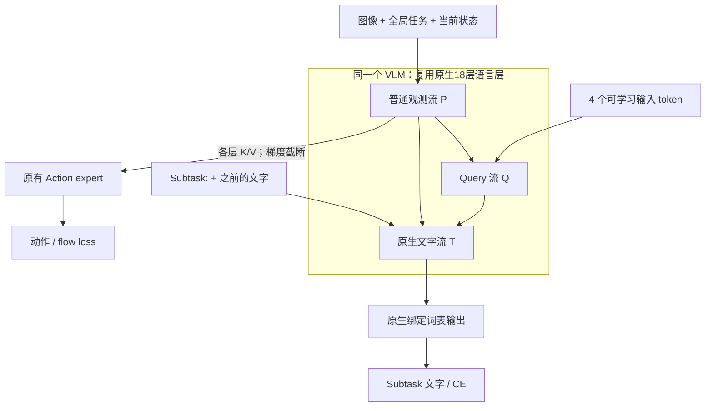

# Q1 草案：直接输入 VLM 的 learnable query tokens

日期：2026-09-11。范围：用户希望在 N1 之后再安排一个 query-token 实验，但接口尚未想清楚，本轮先规划。**这是候选协议，不是已实现/已派发实验；不修改当前实验或 N1 的模型、队列、数据、提醒。**

## 1. 推荐研究问题与边界

研究问题：在 N1 的原生 VLM subtask 生成路径中加入少量可学习输入 token，是否改善当前观测下的选臂/选物与阶段判断，同时不改变 Action 的输入接口？

推荐单组 Q1：4 个只读观测的 query tokens，直接进入 VLM 原生语言层；原生文字流可以读普通观测及 query，Action 不读 query 或文字，原始观测也不读 query/文字。保持 CE→B+Q、flow→A。

不新增独立 Subtask Transformer decoder、Q-Former、分类器、query 后接 MLP 文字生成器、定位头、ranking loss、递归记忆或 query 数量扫描。没有新增独立网络；Q 只是输入侧的可学习向量。

Q1 的含义是“query 辅助原生文字生成”，**不是**“让 Action 读取语义 query”，也不是强制信息压缩瓶颈。后两者都是有价值但不同的实验，需要单独确定，不能作为同一次 Q1 的隐含变化。

## 2. Query 是什么、放在哪里

- 定义 Q0 为形状 [4, D] 的 nn.Parameter，而非用户输入字符串或GT标签。当前配置 gemma_2b 的语言宽度 D=2048，深度18；因此只新增8192个可学习参数，不新增Transformer层。
- 在语言 embedding 层之后，与多模态观测 token 一起进入既有 VLM 第1层，再经过同一套18层；不把query送入视觉编码器，不在每层重新注入一套自由参数，不扩展tokenizer或输出词表。
- 逻辑布局为 `[普通图像/全局任务/state前缀 P] [q1 q2 q3 q4] [原有 Subtask: cue] [右移的已知文字]`。实际可维持多条计算流以保持原生前向数值行为；这些流使用的是相同的B层对象，不是多套网络。
- 初始 Q0 在所有样本间共享，推理时也是训练得到的固定参数；各层隐状态 Ql(P) 随当前图像、任务、状态变化。query不能凭空提供未观测的信息，也不是跨帧记忆。
- 4只是首轮保守工作点，不是经过搜索证明的最优值。无需把四个槽硬命名为左臂/右臂/物体/阶段；无对应监督时这种语义分工不能假定成立。
- 建议用独立seed42随机流生成不同的初始query，尺度对齐官方普通文字embedding的固定抽样RMS；query保留FP32参数，进入层时按原有embedding尺度及dtype转换，sqrt(D)缩放只应用一次。保存抽样ID、初始化张量hash、RMS和随机流身份，不改变B/A初始化、数据采样和flow噪声随机流。

## 3. Attention 合同：不只是“拼几个 token”

表格行是当前正在更新的token，列是它可以读取的K/V来源：

| 当前行读取谁 | 普通前缀 P | Query Q | 文字 T | Action A |
|---|---|---|---|---|
| P | 是，沿用N1有效位遮罩 | 否 | 否 | 否 |
| Q | 是 | 是，4个query可相互读取 | 否 | 否 |
| T | 是 | 是 | 仅当前输入及之前的文字 | 否 |
| A | 是，但每层K/V均detach | 否 | 否 | 原生Action内部遮罩 |

关键点：

1. **禁止 P 读取 Q。** 如果把query直接塞进双向prefix，而普通观测可读query，即使再遮掉A→Q的直接边，query仍可通过Q→P→A影响动作。推荐Q1同时阻断这条间接前向路径。
2. **Q不能读取教师强制文字。** 否则query先读答案，再向早期文字位置传回答案，会产生隐蔽标签泄漏。P也不能读取文字。
3. T仍可直接读取P，所以query可能被忽略；不能宣称全部语义已经被压缩进4个token。若强制T只看Q，就同时改变了信息瓶颈，首轮不做。
4. Action的位置编号和普通prefix cache保持N1的定义，不增加query长度。Q用有效prefix长度起算的4个位置，T的位置在Q后增加4；P、A各自不移位。Q/T拥有与A隔离的缓存，文字生成不能修改P/Q缓存。
5. Query是输入位置，不消耗16个subtask输出token预算；本数据实际最长11个目标token含EOS，不可截断arm后缀。

图中箭头仅表示允许的信息传递，不代表先跑完一个完整VLM再运行另一套VLM；实际依赖发生在每一层。query与文字均没有进入Action的边。

## 4. Loss 与参数更新

与N1相同，普通CE和普通50×32 flow系数均为1，不加query专属loss：

`L = L_subtask + L_action`

`L_subtask = batch_mean(valid_target_token_mean(-log p(y_t | P, Q0, cue, y_<t)))`

CE的监督来自右移GT，包含EOS、排除PAD，仅目标位置计算。自由生成评估不读取GT历史；不能把teacher-forcing CE当成自由生成准确率。

- CE更新B的参与路径（vision/projector/language/native词表）及Q0；A梯度为0。
- Flow更新原有A/action/time投影；B、Q0梯度都为0。
- Q0不需要逐槽标签，CE通过T→Q及Q→P的计算图训练它。Q0的学习目标是帮助文字预测，不自动等同于目标定位或可解释的语义槽。
- 建议仍仅两个AdamW owner：B侧包含B+Q，A侧只含A；各参数只拥有一次，绑定词表仍去重。B+Q联合clip norm1，A独立clip norm1，与N1相比需明示B侧裁剪组增加了Q。
- 原生B参数的配置与N1相同；query不另设高学习率。日志分别显示B和Q的裁剪前范数、实际B+Q裁剪范数/比例、Q的FP32更新/RMS，不把B+Q曲线误写成纯B。

同一checkpoint、同一观测和噪声下，改变Q不能改变A输出；但跨训练更新，Q会改变CE对B的梯度，B权重随之变化，A读取的普通观测特征也会变化。这是间接的训练效应，不能把“flow不更新Q”误解成“query方案绝对不可能影响最终动作表现”。

## 5. 与N1匹配的正式配方（待确认后实施）

| 项目 | Q1建议 |
|---|---|
| 排序 | N1及其最终门槛成功结束后，Q1工程门槛，再正式Q1 |
| 初始化 | 官方fresh B/A + 新query；不接着N1权重继续训练 |
| 预算 | seed42 / 5000更新 / global256 / 8卡 |
| packing | 尽量匹配N1最终容量通过的micro/accum；新增query必须另测容量 |
| 数据 | Datasets/eggplant_potato_reach_arm_v1，原178train/20val/no-test |
| norm/cache | 原train-only norm与.stage1_staging/piper_rgb224_reach_arm_v1 |
| 优化 | AdamW .9/.95、eps1e-8、weight_decay1e-10；warmup500、peak2.5e-5、end2.5e-6 |
| 记忆/采样 | 无递归、unroll1、同N1的episode流与数据随机流 |
| 模型差异 | +4个输入query，以及明确的query可见性/位置规则 |
| 保存评估 | 每500；最终5000为主，20个val episode作成对分析 |

“接在N1之后”只是调度顺序，不是以N1为finetune parent。必须保持官方fresh和同预算，否则训练时长与初始化成为额外混杂因素。

不预先承诺训练时长；即使只增加8192个参数，query仍有各层注意力/KV/激活开销。八卡工程后用实测吞吐给ETA。所有GPU任务通过run_concurrent，保持不查GPU占用、不停止其他任务/guard、按ETA单次跟进的约束。

## 6. 必需工程门槛

1. Q数量设为0时，同权重、输入、遮罩/位置退化为N1；query路径不能暗中替换VLM或Action。
2. 真实梯度：CE→Q以及B视觉/投影/语言/词表非零，CE→A零；flow→A非零，flow→B/Q零。检查唯一optimizer所有权、DDP/accum全局归约。
3. 改未来GT时，P/Q和更早文字logits不变；改/去掉/打乱query时，P和同次A不变（同权重同噪声）。
4. 原生teacher-forcing、逐token缓存及独立联合前向控制一致；区分有效位与PAD、不同BF16计算形状及FP32控制，不凭宽阈值遮掩结构差异。
5. Query及文本使用私有缓存；自由生成前后，原始Action prefix cache及动作不变。reset/session没有历史query状态。
6. 真八卡容量/4→8恢复，query参数与FP32优化状态保存恢复，完整50×14原生输出、新schema严格加载。正式从官方fresh开始，不继承工程更新。
7. 新文件/variant/schema/provenance、query初始化hash、mask/位置版本独立记录。现有在训与N1等待源码逐项保持，完成测试并commit后再派发。

## 7. 如何判断是否有价值

- 主Subtask指标：自由生成整句EM、macro-F1、reach阶段actor/phase-object、首帧和起始一秒、边界错误及延迟。不能只报告CE下降。
- Action：同一验证帧/噪声，native14与all32 flow、前25/全50、关节/夹爪分别与N1比较。动作loss是离线代理指标，不是真机任务成功率。
- 20个val episode逐episode成对比较，置信区间按episode重采样；单seed初步结果不夸大。
- Query诊断：检查实际梯度/更新、不同观测下的隐藏状态是否变化；注意力热图只作描述，不能当成物体定位的证明。
- 可在同一已训checkpoint里遮掉T读取Q的边、保持位置不变，观察文字变化；这是依赖性/分布扰动诊断，不等价于训练时的“固定query”对照，不用于独立证明query可学习性的因果收益。
- 如果Q1胜过N1，可说本query输入设计在相同预算下更好；不能据此断定是学习性、额外计算槽、位置变化中的某一个因素所致。严格拆分这些因素需要另训等长固定query等对照，不在本次单组范围。
- 若subtask提升但action没有提升，结论就是辅助生成改善、动作收益未得到证实；这对本只读Q1完全可能。

## 8. 其他理解，不在推荐Q1里混入

| 设计 | 研究问题/代价 | 本轮建议 |
|---|---|---|
| 本Q1：query只读P，T看P+Q，A只看P | 新输入槽是否帮助原生文字生成；动作输入保持原样 | 首轮推荐 |
| Q进入共享双向prefix，或A直接看P+Q | 让动作使用学习的query表示；即使flow梯度截断，动作前向已改变 | 要先明确此目标，单独设计 |
| T只能看Q，不看P | 强制query成为语义信息瓶颈 | 同时限制信息，首轮不做 |

只读query降低了同权重下对普通prefix/动作前向的直接扰动，但新增learned embedding和文字位置依然改变预训练输入分布。不能说完全没有OOD，也不能说有分布变化就必然失败；需以上述工程/评估证据判断。

## 9. 参考概念与项目区别

- [The Power of Scale for Parameter-Efficient Prompt Tuning](https://arxiv.org/abs/2104.08691)：学习连续soft prompts的概念来源之一；该论文主设定冻结语言模型，本Q1仍由CE更新B，因此不是照搬其参数高效调参设定。
- [BLIP-2](https://arxiv.org/abs/2301.12597)：使用额外的Querying Transformer桥接冻结视觉/语言模型。本Q1不采用其Q-Former，不增加独立Transformer，只在既有VLM内处理输入query。

以上论文支持概念区分，不是对本Piper数据或Q1效果的证据。
