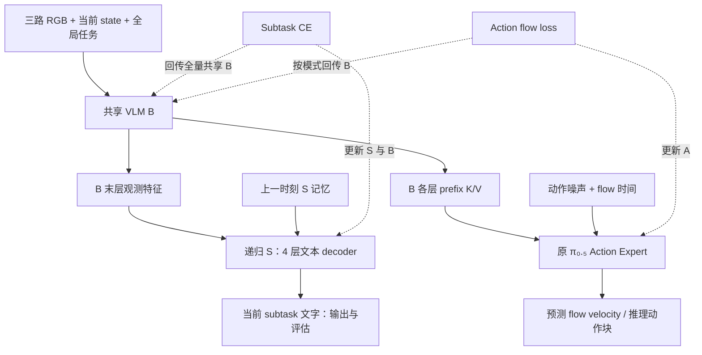

# π₀.₅ 共享 VLM 双分支实验重设计

> 最新修订（2026-09-11）：用户选择先仅做Action-stop，只有subtask CE更新VLM，action只更新A。当前首轮规范见同目录 `action_stop.md`，服务器为 `docs/pi05_parallel_action_stop_20260911.md`。以下保留原三组设计历史；其中三组调度、共用LoRA槽位及0.3梯度配平规则已被覆盖，不执行。

日期：2026-09-11。状态：设计完成，尚未实现、训练或部署。

服务器权威副本：`/media/raid/workspace/surongpeng/ws_lixing/agentic-openpi/docs/pi05_parallel_multitask_redesign_20260911.md`。

## 1. 最新目标与本次范围

用户澄清的原始意图是：VLM 为共享主干，分出 subtask 和 action 两支；subtask loss 必须回传 VLM，action loss 回传 VLM 的范围分三种模式。本轮请求为“根据最新的要求重新设计实验”，交付设计与项目指导更新，不据此启动训练、修复并恢复旧队列、部署模型或执行机器人动作。

过去的实现是 B → S → 生成文字 → 同一 B → A，CE 仅更新 S，action 更新 A 与指定 B。这与新目标不同。旧结果和源码保留为历史对照，不改写其梯度定义、训练记录或完成状态。

新设计回答：在相同语义监督回传 B 的条件下，action 不回传、有限回传、全量回传，对动作与 subtask 表现有什么影响？三组本身不能单独证明“CE 回传 B 优于无 CE”；证明该结论需要后续匹配的辅助任务消融。

## 2. 首轮架构

这是共享主干与两个任务头的示意；A 实际读取各层 prefix K/V，不能为图形简化而改成只读 B 最后一个向量。训练可采用同一 joint prefix/suffix forward，同时取得 B 最终隐藏状态供 S 使用；原 prefix 不读取 action suffix。推理允许复用同一观测的 prefix 计算，不把“逻辑并行”宣传为已实现同时执行或已有速度收益。

动作侧使用现有普通 pi05 提示模板 `Task: {global_task}, State: ...; Action:`；删除新路径中的 `, Subtask: ...` 拼接。真实或生成 subtask 都不能进入 B/A 的观测输入。A 的网络结构、原生 Piper 数据约定和 50×32 内部接口保持。

S 保留当前 4 层、width512、8 heads、FFN2048、max_tokens16、自回归 CE/生成；递归模块为 Attention + GRU、4×512 记忆、unroll4。共有 S 从同一 seed42 初始化。S 继续使用独立的词嵌入/输出投影视图；复用 B 词表时在 S 的词表查表与输出打分路径 detach，CE 通过观测特征回传 B，而非借共享词表直接更新来代替视觉语义学习。B 的任务/state embedding 经观测路径仍可接受 CE 梯度。

必须移除新模型观测特征提取的全局 `no_grad`，移除 S 输入处对 B 特征的 detach。需要同时检查图像编码器、投影器和语言层的真实梯度，不能只修改 `requires_grad`。

### 历史信息的明确边界

首轮递归记忆仅属于 S。CE 可经 unroll4 的观测驱动记忆回传到对应历史观测的 B 特征；更新边界 detach carry，新任务/新会话 reset。不使用真实历史标签或 teacher-forced 文本隐藏状态更新记忆。

没有 S→A 运行时通路，所以本次会话的 S 记忆不会即时传给 A。A 是当前观测条件下的策略，即使 B 参数受时序语义监督训练。移除旧文字回填也移除了原有的历史到动作文字桥；这是真实结构变化，比较必须公开该差异，不把结果单独归因于 CE 路由。

首轮暂不引入共享时序主干、learnable query、定位 head、语义 token 加权、前缀动作加权或 ranking。这样建立清晰的并行双头基线；这些方向保留为后续逐项实验，未被宣称无效。

## 3. 三组正式实验设计

CE 到 B 的范围三组固定：所有参与 S 观测特征计算的 B 参数，包括视觉编码、视觉投影、语言骨干及观测路径中的 token embedding。无计算依赖的参数不要求出现非零梯度。

| 名称 | CE → B | Action → B | Action → A | CE → S |
| --- | --- | --- | --- | --- |
| `parallel_action_stop` | 全量参与路径 | 无 | 有 | 有 |
| `parallel_action_limited` | 同上 | 仅末两层语言块 LoRA | 有 | 有 |
| `parallel_action_full` | 同上 | 全量参与路径 | 有 | 有 |

不要称第一组为 Frozen VLM：其 B 会被 CE 更新，A 的输入特征也随之变化。

### 保持三组参数化相同

沿用 limited 的末两层 q/k/v/o、gate/up/down LoRA，rank16/alpha32。为避免“不同参数化”成为额外变量，三组都装同样的 LoRA 槽位、相同初始化，初始 delta 输出为零。CE 三组都更新 B 的基座参数与这些 adapter；action_stop 对 B 全部屏蔽 action 梯度，action_limited 仅保留 adapter action 梯度，action_full 保留基座与 adapter action 梯度。

因此“limited”仅指 action 梯度范围，绝不表示整个 B 的训练仅限 LoRA；所有三组的 B 基座都接受 CE。导出合并 LoRA；精确恢复保留未合并状态。

仅改变 action 梯度参数掩码，其他数据、初始化、S、优化器、loss 定义与预算保持相同。历史 Frozen/Limited/Full 不属于这组三个新模式。

## 4. Loss、梯度与优化器

基础监督使用普通 CE 与普通全32维 flow MSE：

`L_S = mean_examples(mean_valid_tokens(-log p(target_token)))`

`L_A = mean_batch,time,dim((predicted_velocity - (noise - normalized_action))**2)`

EOS 计入有效 token，PAD 不计；action horizon50，训练维度32，另记录 native14 与前15/25/50诊断。取消 subtask 条件 dropout，因为新 A 没有这个条件。S 的 teacher forcing 仅在 S 内发生；生成文字仅用于输出/评估，训练动作不等待自回归生成。

记 `g_B^S = dL_S/dB`、`g_B^A = dL_A/dB`，各组 action 梯度掩码为 M：

`g_B = lambda_S * g_B^S + M * g_B^A`

`g_S = lambda_S * dL_S/dS`

`g_A = dL_A/dA`

S→A 与 A→S 梯度必须为零。部分屏蔽是按 loss 的参数梯度路由，不能用整组 B 的 `requires_grad=False`，否则也会切断 CE。避免在混合梯度之后才试图辨认来自哪种 loss 的梯度。

### 一次梯度尺度校准，再固定系数

原先 S 参数范数不能用于决定新 B 梯度权重。拟在正式训练前使用16个固定的、仅来自 train 的真实 global256/unroll4 batch，对同一官方初始化模型分别计算全 B 上的 CE 梯度和 full-action 梯度，先按实际全局 batch 平均，再求范数。不执行 optimizer update，不使用验证表现选权重，不计为额外训练。

拟定工程初值规则：`lambda_S = 0.3 * median_j(||g_B^A(j)||_2 / ||g_B^S(j)||_2)`。0.3 是保守的初始设计选择，不是已证明最优的权重；用于防止新 S 在初始化时以过大梯度冲击 B。记录实际值、每个 batch 的比例与分层梯度，不以两种标量 loss 相等为目标。出现非有限值、零梯度或极端不稳定先定位原因，不能悄悄裁出一个系数继续训练。

相同 lambda_S 固定用于三组全程；action-stop 使用同一个由参考 full-action 路径得到的系数，不因本组 action→B 关闭而设成零。初始校准不能保证后期平衡，训练器记录比例变化，但首轮不引入动态加权、PCGrad 或未记录的在线调参。正式初始化和所有 RNG/采样状态从头恢复，不能承接校准过程中的 carry、数据游标或参数状态。

### 唯一参数所有权

使用互不重叠的 S、B、A 参数组，每个参数只归一个 AdamW 优化器/状态所有者。B 先合并允许的 CE/action 梯度，再单独 clip norm1，并更新一次；S、A 各自 clip norm1、更新一次。不要把 B 同时交给两个 AdamW 更新两次。梯度日志包含加权前、加权后、合并后和裁剪后定义；参数更新/参数范数比需按组记录。

分布式需先实现并验证按loss路由的规约：不能混用 autograd.grad 与 DDP 默认 hook 导致重复 all-reduce、遗漏规约或错误的 world/accumulation 缩放。用最小可控模型与真实8卡验证单卡等效全局batch、loss路由、4→8步保存恢复、非有限中止和每参数仅一次更新。

## 5. 共同训练配方与隔离

- 官方 `pi05_base_pytorch/model.safetensors` 初始化 B/A，固定已审计 SHA；不继承旧 reach-arm、semantic、M3/R2 权重或 optimizer。
- 新 S、adapter 和所有工程/正式随机数来源独立记录，三组相同初始模型哈希。
- `Datasets/eggplant_potato_reach_arm_v1`，198 episodes；固定178train/20val/no-test 与现有 train-only norm/精确 RGB 缓存，原生12关节delta+2绝对夹爪约定。
- 全部使用现有 reach-only actor 标签、相同完整因果 episode 采样，不新增决策重采样或关键帧标注预算。
- 每组5000 optimizer updates、global256、seed42、8卡；首测micro32/accum1、workers4、unroll4。新的 CE→vision 梯度图可能增加容量成本，需真实容量和吞吐测量后才能定案。必要时三组统一改变micro/accum并保持global256，不跨packing声称精确恢复。
- 所有组相同 AdamW betas0.9/0.95、eps1e-8、weight_decay1e-10；各参数组共用原schedule：warmup500、peak2.5e-5、decay5000、end2.5e-6。lambda_S 独立显式记录，不偷偷改变 B/S 学习率。
- 每500步验证/存盘；最终step005000优先交付，保留验证最优及其真实步数，不用较早候选代替最终结果。
- 建议新 family=`pi05_piper_parallel`，新 variant=`official_pi05_parallel_multitask_v1`；schema编号在实现时检查现有注册表后分配，不复用schema7/8/9装载语义。
- 拟输出 `checkpoints/pi05_piper_parallel/{action_stop,action_limited,action_full}_seed42_v1`。这些只是计划路径，当前未创建候选。

## 6. 必须先通过的工程门槛

1. 只有 CE 时：S、B视觉/投影/语言出现预期梯度，A严格无梯度；仅 action 时：A有梯度，S无梯度，B严格遵守三模式掩码。共享embedding别名与LoRA基座逐项核验。
2. 同一checkpoint/观测/噪声，替换或禁止 S 文字输出不会改变 A 结果；S 关闭和记忆reset不会改变 A 的数学输出，时间调度差异单独报告。随机数流要隔离，不能由生成调用消耗噪声而制造差异。
3. 所有真实或生成subtask标签均不进入观测prompt；prefix不读取动作suffix；记忆不使用未来观测/真实历史标签；同一会话因果性与跨会话隔离通过。
4. 同一初始B/A与相同普通prompt、数据预处理、固定噪声，带零输出LoRA的A前向与原生直接action路径在预先声明的精度容差内一致；gradient mask不能改变本次前向数值。
5. 三组共同初始化一致，梯度规约与单次更新正确，真实8卡4→8保存恢复、merged native50×14推理、外部subtask拒绝和新schema身份检查通过。
6. 三组真实容量/吞吐门槛后才派发正式任务；GPU工作统一走reservation run_concurrent，保护其他任务和guard，不查GPU占用。工程日志与正式实验分开。

## 7. 评估与可证实的结论

主动作指标：统一固定样本/flow噪声下的val native14与all32、前15/25/50误差，关节与夹爪分开；起始1秒、reach-lid与reach-object起点的选臂指标；同观测只换全局目标的响应，paired场景前后/左右交换。臂运动支配指标是代理指标，不等于成功。

S指标：完整因果验证序列EM/macroF1、actor/object与阶段混淆、边界延迟/回跳、S记忆reset及中途冷启动。Teacher-forced CE小不等于自回归文字正确，也不等于A成功。

工程动作独立性不再使用“oracle/empty subtask提高动作”作为主质量消融：在新架构中S输出应不影响同一次A前向，文字干预是路由验证。若其改变动作，需要找实现泄漏。

真机阶段另行明确当前场景与执行授权；采用同一场景配对、随机模型顺序、相同RTC开关/25步/30Hz/噪声策略和记录定义。统计选臂、目标实例、阶段完成、全任务成功、停顿与人工接管；失败/中止均保留。RTC是独立执行机制，首轮不比较不同RTC设置。

三组能比较action梯度范围；要声称CE联合训练有效，后续加一个匹配动作梯度模式的对照：保留同样S计算与CE训练，但在S→B边界detach，使B只接受该模式下的action梯度。该对照是后续单独决策，不自动增加第四组正式训练。旧串联候选可同场景作实用参考，但同时改变条件与历史通路，且部分旧组split/训练长度不同，不能作为单变量机制证明。

历史实验提示Full后期train/val差距较大，故必须保留5000全程曲线和最终候选，不仅看训练loss最低或只挑最有利的早期点。

## 8. 记录、W&B与运行边界

沿用标准显式trainer/step、train/val分离、rank0唯一writer、local JSONL持久化。新动作条件为global-only，需新定义/版本或明确独立display_set，不能套用旧“generated-subtask条件”语义。

必记 `loss/subtask_ce_raw`、`loss/subtask_ce_weighted`、`loss/action_flow_all32`、lambda；`grad/B_from_subtask_raw`、`grad/B_from_action_raw`、加权比例、共同允许参数上的cosine、B vision/language/LoRA各组梯度、S/B/A裁剪与相对更新范数。Action-stop没有可比的共同action梯度时cosine标N/A，不能伪造为0。正式诊断使用预声明稀疏cadence，开销计入吞吐；不增加助手进度轮询。

首10步执行一次local/cloud及图表示例核验；此后按真实秒/步估算训练、验证/存盘和加载门槛总时间，并沿用一次ETA跟进。当前不创建新W&B run/view或修改提醒，因为尚未启动本设计。

此前 `decision_prefix/decision_grounded` 是旧串联路线的队列。2026-09-11早间只读核查发现旧semantic_s训练完成，接续器在旧scheduler路径字符串校验处失败；这是历史核查，不代替未来操作前的身份和产物检查。本轮不恢复它，也不信号操作旧scheduler。不把旧排队授权当作新双分支实现已通过或正式训练已获派发。

## 9. Learnable query 的后续位置

第一轮继续让S读取B末层观测序列，验证新的CE→B合同。之后才做末层query聚合与B内逐层query的匹配比较，query数量/容量、记忆与监督预算保持一致。

新合同允许CE训练B，因此旧query讨论中“B固定权重/每层detached K/V以阻止CE”的限制不再适用于这个新实验族；不能机械复制旧实现方案。S query/文字仍不进入A的prefix，不因新增query自动引入S→A隐状态通路。若以后引入共享历史或目标隐状态，需要单列架构实验。

## 10. 本轮交付状态

本方案为可审阅设计，工程梯度校准、实现、8卡验证、训练、部署、真机结果均未完成。更新服务器AGENTS.md记录用户纠正及未来设计边界，保留历史证据与源码。
