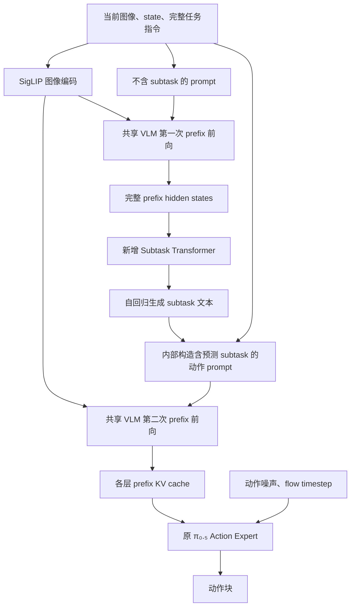

本方案将一阶段目标定义为：基于当前官方 OpenPI π₀.₅，实现“观察当前场景 → 自回归生成当前 subtask 文本 → 根据生成的 subtask 预测动作块”，并对 subtask loss 与 action loss 建立可测试的梯度隔离。

版本：2026-09-07，开发设计草案。用户已确认：一阶段生成的 subtask 要参与动作预测。本文件保留初始设计，当前实现、训练和验收结果以 `docs/pi05_subtask_stage1_progress.md` 为准。

基线仓库为服务器 `/media/raid/workspace/surongpeng/ws_lixing/agentic-openpi`，当前分支 `upstream-openpi-main`，提交 `215abfb217dbac7d5f1273282331b9b1866c0479`。本方案只基于这份官方代码，不依赖其他实验分支。

**一阶段验证三个问题：模型能否生成正确的当前阶段描述，生成的描述能否改善动作，以及两类监督能否按预定边界更新参数。**

输入是当前三路相机图像、机器人 state 和完整任务指令；输出是当前 subtask 文本和连续动作块。部署输入中不包含 subtask 真值、未来图像或未来轨迹。训练中的 subtask 字段作为生成监督单独保存，不追加到生成器的输入 prompt。

这里的监督含义是“当前应该执行的 subtask”。已有标签描述示教轨迹所处的阶段，因此一阶段首先验证阶段识别与条件动作生成；开放任务规划、失败恢复、跨任务组合和任务完成检测仍需要额外证据。文本 EOS 仅表示本条 subtask 句子结束，不表示机器人任务结束。

**数据检查已经覆盖全部 198 个 parquet，设计应以这些实际统计为准。**

数据路径：`/media/raid/workspace/surongpeng/ws_lixing/agentic-openpi/Datasets/eggplant_potato_gripper_binary`。

| 项目 | 实测结果 | 对设计的影响 |
|---|---|---|
| 轨迹和帧数 | 198 episodes，132,939 帧，30 FPS，约 73.9 分钟 | 相邻帧相关性很强，不能将 13 万帧视为独立样本 |
| 任务分布 | eggplant 与 sweet potato 各 99 episodes | 按任务分层划分数据 |
| 状态与动作 | 均为 14 维 absolute；三路相机 | 保留 π₀.₅ 的 32 维接口，在适配层补齐 |
| subtask | 12 种不同文本；无空标签；每条轨迹 8 个连续阶段 | 采用小型文本生成 Transformer，并报告类别均衡指标 |
| 标签文本长度 | 使用缓存中的 PaliGemma tokenizer，含 EOS 为 4–8 token | 初始生成上限取 16 token，独立于主 prompt 长度 |
| 帧索引 | 所有 episode 内连续 | 可按帧严格对齐标签和动作块起点 |
| 50 帧动作窗口 | 123,237 个完整窗口中，66,147 个跨越 subtask 边界，约 53.67% | 单独评估边界；动作预测长度和实际执行长度分开设置 |
| 夹爪 action | 第 6、13 维取值为 0 和 0.09 | binary 不等于已编码为 0/1，不能按目录名推断单位 |
| 夹爪 state | 两维合并范围约 0.00742–0.07 | state/action 夹爪尺度和控制器约定需核对 |

两类任务的阶段顺序均为：接近盒盖把手 → 抓住把手 → 移开盒盖 → 接近目标物 → 抓取目标物 → 移到盒子上方 → 释放目标物 → 盖上盒盖。标签原文保留，包括大小写和现有措辞；评估可另设明确的大小写/空白规范化映射，不改写原始 parquet。

数据划分建议采用按 episode 分层的 158/20/20：每个任务 79 条训练、10 条验证、10 条测试。划分前检查采集场次、重复轨迹和近重复场景；如存在组关系，以组隔离优先于精确数量。所有帧、动作窗口和可选历史观测均留在各自 episode 所属集合，训练集单独计算归一化统计。固定 split manifest、随机种子和数据指纹，后续所有对照共用。

当前轨迹阶段顺序很规律，需要增加“任务指令 + 已经过时间”的诊断基线，并检查去掉图像后的表现。这个诊断只能用实际可观测的 elapsed time，不能使用真实 episode 终点计算归一化进度。主模型不输入 episode 编号、frame_index、timestamp 或未来阶段边界。

第一轮以当前帧为输入。抽查抓取、释放等阶段的边界视频；若单帧存在明显不可辨识情况，再做仅使用过去观测的短历史消融。不要通过读取未来帧来改善当前标签预测。

**建议新增一个独立的小型自回归 Transformer decoder，保持现有 π₀.₅ action expert 的动作结构。**

模型记为三个部分：VLM backbone `B`、subtask decoder `S`、原有 flow matching action expert `A`。`B` 包含 SigLIP、图像投影、PaliGemma 语言模型与其 token embedding；`A` 包含原 action expert、动作输入/输出投影和 π₀.₅ 时间 MLP/AdaRMSNorm 参数。



图中 B1 和 B2 使用同一份 VLM 权重；它们是两次前向，不是复制两套大模型。图像编码结果在同一次请求内复用，两条路径使用完全相同的当前观测和图像增强结果。

Subtask decoder 的初始设计值如下，属于待小样本实验验证的起点。

| 配置项 | 初始设计 |
|---|---|
| 结构 | 4 层 decoder，每层 causal self-attention + 对 VLM prefix 的 cross-attention + FFN |
| 宽度 | hidden size 512，8 heads，FFN 2048 |
| 视觉语言 memory | VLM prefix 最后层所有有效 token，2048 → 512 的可学习投影；不只取末尾 token |
| 文本 tokenizer | 复用 PaliGemma SentencePiece tokenizer，保留 BOS/EOS/PAD 约定 |
| token embedding | 读取冻结的原 VLM embedding，经新的 2048 → 512 投影 |
| 文本输出 | 新的 512 → 2048 投影后，使用冻结的 VLM embedding 表转置产生词表 logits |
| 自回归上限 | 初始 16 token，包含 EOS；超过上限记录为截断 |
| 推理 | 初始 greedy decoding，每条样本独立记录 EOS 和有效长度 |
| 容量 | 新增可训练参数预计在两千万量级，实施时以实际参数统计为准 |

冻结并复用词表矩阵能避免新建巨大的可训练词表头，但不会消除全词表 logits 的计算成本。词表矩阵虽然冻结，输出矩阵乘法仍必须允许梯度回传到 decoder 和输出投影，不能把整个输出计算包在 `no_grad` 中。

主实验采用实际文本 token 生成。12 类分类器作为能力/成本对照，候选文本约束解码作为可选消融；不能用分类器查表的结果替代“新增自回归 Transformer”的主实验，也不能将受限标签集合内的成功描述成开放词汇泛化。

**动作通过模型内部生成的文本获取 subtask 信息，第一版采用两次 VLM prefix 前向作为参考实现。**

先按官方 π₀.₅ 格式构造只含任务和离散 state 的 prefix，供 `S` 预测当前 subtask。随后内部构造动作 prompt，例如：

```text
Task: Put the eggplant into the box,
Subtask: grasp the eggplant,
State: <离散 state>;
Action:
```

真实生成使用固定的单行序列化格式，上面的换行仅为展示。动作 prompt 的 template、tokenizer 和长度上限在训练与部署中完全一致。主 prompt 初始沿用 200 token 预算，统计完整输入长度后再决定是否增加到 256；subtask 的 16 token 输出预算单独配置。

这种接法复用现有 action expert 从 VLM KV 读取语义条件的路径，首版无需新增动作 cross-attention 或将两个不同 Transformer 的 cache 直接混接。生成器 hidden states 不直接送入动作模型；动作实际看到的是对外可解释、可记录的生成文本。

官方 prefix 使用双向注意力，新增 subtask 文本会改变整段 prefix 的表征。因此第二次 prefix 必须正确重算；不能直接在第一次 KV 后追加文本并声称与双向前向等价。后续若需要单次 prefix 或额外条件 attention 的加速设计，作为单独架构变更验证。

首版延迟包含两次语言 Transformer prefix、一次短文本自回归生成和原来的 flow 去噪。实际成本需实测，不预先承诺实时。可以复用 SigLIP 特征，并在第二次 prefix 完成后复用其 KV 进行全部去噪步骤。

**损失隔离要落实到参数所有权和计算图，单独记录两个 loss 或分开 backward 都不够。**

建议先在训练集上建立官方 π₀.₅ 的动作基线，得到数据集适配后的 checkpoint `C0`。这一步没有 subtask loss，可按官方动作微调方案训练 VLM 和 action expert。后续分层模型和匹配对照均从同一 `C0` 初始化。

在一阶段的分层训练中，默认冻结 `C0` 的全部 VLM backbone，分别训练 `S` 和 `A`。这样共享表示固定，两类监督没有共享的可训练参数，隔离关系最容易解释和验证。

| 参数组 | subtask loss 更新 | action loss 更新 |
|---|---|---|
| SigLIP、图像投影、PaliGemma、原词表 embedding | 否，冻结 | 否，冻结 |
| Subtask decoder、memory 投影、token 输入/输出投影 | 是 | 否 |
| 原 action expert、action 投影、时间条件模块 | 否 | 是 |

Subtask 目标为标准的序列交叉熵：

\[
\mathcal L_{sub}=-\frac{1}{B}\sum_i\frac{1}{n_i}\sum_j m_{ij}\log p_{\theta_S}(y_{ij}\mid y_{i,<j},\operatorname{sg}(B(o_i,g_i))).
\]

`m` 仅覆盖有效目标 token，包含 EOS，排除 padding。按每条样本的有效长度归一化后再平均，避免较长标签获得不必要的额外权重。缺失标签样本只跳过 subtask 监督，不影响动作训练；当前数据没有缺失值，但接口仍应处理这种情况。

Action loss 保留官方 flow matching 定义：

\[
x_t=(1-t)a+t\epsilon,\quad u_t=\epsilon-a,
\]
\[
\mathcal L_{act}=\mathbb E\left[\|v_{\theta_A}(x_t,t;\operatorname{sg}(KV_B(o,g,\tilde s)))-u_t\|^2\right].
\]

`tilde s` 是当前训练子阶段选择的 GT 或模型自回归预测文本。最终训练子阶段和正常部署中使用模型预测；`sg` 表示 stop-gradient。模型返回并分别记录 `loss_subtask` 与 `loss_action`。可以对两个 loss 相加后一次 backward，但必须使用不重叠的 optimizer 参数组，并分别裁剪梯度。

必须成立的梯度条件为：

\[
\nabla_{\theta_S}\mathcal L_{act}=0,\qquad
\nabla_{\theta_A}\mathcal L_{sub}=0,\qquad
\nabla_{\theta_B}\mathcal L_{sub}=\nabla_{\theta_B}\mathcal L_{act}=0.
\]

动作使用的预测必须来自不读取 GT 历史的自回归生成。对 teacher-forcing logits 逐位置取 argmax，或把 teacher-forcing decoder hidden states detach 后送给动作，都仍会携带真值历史信息，不能当作部署时预测。

如果以后需要解冻共享 VLM，应明确只允许一种监督拥有它。一个可研究的扩展是 VLM/其独立 adapter 仅由 subtask CE 更新，action 分支使用逐层 detached prefix KV；另一种是动作专用适配器与语义专用适配器分开。它们会改变当前冻结表示的训练假设，应各自建立对照，不能在默认方案中隐式混入。

官方 Knowledge Insulation 说明了“动作专家可读取 VLM 信息，但其梯度不回到 VLM”的设计，并同时使用离散动作等目标训练主干。本方案的一阶段冻结策略是针对已预训练并经数据适配的 π₀.₅ 的简化选择，不等于完整复现该训练配方，也不能假设冻结一定最优。[官方 KI 说明](https://www.pi.website/research/knowledge_insulation)

**训练分成几个可验收的小步骤，逐步消除对 subtask 真值的依赖。**

| 步骤 | 训练内容 | 条件来源与验收 |
|---|---|---|
| M0：数据适配与动作基线 | 从官方 π₀.₅ 权重建立 `C0`；固定 split、归一化与机器人适配 | 输入只有任务/图像/state；验证动作尺度、离线误差与基线行为 |
| M1：Subtask 生成预热 | 冻结 `C0` 的 VLM 和动作模块，仅训练 `S` | decoder 用 GT 历史做 CE；评估必须使用完整自回归生成 |
| M2：条件动作学习 | 冻结 VLM，训练动作 expert；可继续独立训练 `S` | 短暂使用 GT subtask 作为动作条件预热；这是训练辅助和 oracle 对照，不是最终系统 |
| M3：预测条件训练 | 同时训练 `S` 与 `A`，梯度按上表隔离 | 预测文本比例由 0.25/0.5/0.75 提升到 1.0；最后至少 20% 更新不再用 GT 动作条件 |
| M4：完整推理与消融 | 固定选模规则，评估全自生成链路 | 正常接口没有 GT subtask；分别报告语义、动作、边界和延迟 |

M2 的 GT 条件阶段建议不超过条件动作训练更新数的 20%；后续 schedule 以验证集的自回归生成和预测条件动作指标调整，不根据测试集调参。可在 M3 加入约 10% 的 subtask 条件置空，让同一动作 expert 学会在没有可靠描述时使用原观察和全局指令；最终条件来自预测或主动置空，不再来自真值。

预测生成应使用 greedy 和确定性推理设置，在 `no_grad` 下完成。所有相关 forward 完成后再更新参数，避免在 teacher-forced CE 图仍存活时更新 decoder 权重。预生成训练集预测可以用于加速冻结生成器阶段；若生成器继续更新，这些缓存会变旧，需要明确刷新规则。

Subtask 预热使用按任务/阶段分层的采样以控制长阶段占比；动作训练保留真实时序采样分布。若联合训练需要不同 batch，两条数据迭代器仍只能访问同一训练 split，独立计算两个目标。验证和测试始终使用自然分布，并同时给出 macro 指标。

建议初始优化器设置：新 decoder 学习率 `1e-4`，预训练 action expert 为 `1e-5`，各自 warmup 约 200–500 updates、各自梯度裁剪 1.0。先跑 16–32 个覆盖所有标签的小样本过拟合实验，再做约 1k–3k updates 的 subtask 试跑及约 3k–5k updates 的动作条件试跑，依据验证曲线决定完整预算。这些是调试起点，不是效果保证。

服务器检测到 8 张 A800 80GB；这不代表当前 GPU 已空闲或预留。先单卡 batch 1–2 验证图和显存，再按实测使用多卡 DDP，初始全局 batch 32–64。沿用官方实现的精度约定，CE 归约使用 FP32；冻结 VLM 维持 eval 模式，新 decoder 和 action expert 可开启梯度检查点。不要让外层 `model.train()` 意外切换冻结 VLM 的模式或让其 gradient checkpointing 关闭需要的 KV cache。

**动作块跨阶段是单独的实验变量。**

主实验先保留官方 `action_horizon=50`、32 维动作接口和默认 10 步 flow 采样，保持与基线可比。数据为 30 FPS，50 帧约 1.67 秒。运行时初始考虑每次执行前 10 帧，再用新观察重新生成 subtask 和动作；10 帧约 333 ms，能否采用该周期取决于实测端到端延迟。模型预测 50 帧不等于必须执行全部 50 帧。

每个动作块的 subtask 标签定义为块起点 `s_t`，它不意味着未来 50 帧都属于同一阶段。主训练不按真值未来边界截断动作块或提前切换指令。分别统计不跨界和跨界窗口的误差；如跨界显著限制效果，再对所有匹配方法同步做 `H=10/20/50` 消融。

首版每次动作重规划时都重新预测 subtask。若出现语义抖动，再增加只使用过去预测的去抖/短历史消融，并报告引入的切换延迟。不要用固定八阶段状态机把错误预测自动改对，以免掩盖生成器能力。

**开发接口应让监督目标与部署输入物理分开。**

建议保留现有 `Observation` 作为真实模型观察，新增训练 batch 封装 `SubtaskTrainingBatch(observation, actions, subtask_target_ids, subtask_target_mask, metadata)`。标签必须从 dataset wrapper 经 collate 到达 trainer，不能指望在原字典里多放一个 `subtask` 就能保留下来：当前机器人输入适配会重建字典，`DataLoaderImpl` 最后也只返回 Observation 和 actions。

目标 token 化为 `[BOS] + label_tokens + [EOS]`，decoder 输入与目标错开一位；PAD mask 和 prefix image/text mask 分开管理。训练元数据中的 episode/frame 只供抽样、对齐和评估使用，不进入 forward。

在模型封装中明确拆出 `encode_images()`、`prefill_prefix()`、`generate_subtask()`、`compute_action_loss_from_prefix()` 与 `sample_actions_from_prefix()`，训练和推理共用 prompt builder。准备输入时保留全局指令，并只做一次机器人适配和数值归一化，避免第二次动作 prompt 构造再次归一化 state。

以下路径均相对于服务器项目根目录；完整根路径为 `/media/raid/workspace/surongpeng/ws_lixing/agentic-openpi`。

| 文件/位置 | 开发内容 |
|---|---|
| 新增 `src/openpi/models_pytorch/subtask_decoder.py` | 小型 causal decoder、cross-attention、文本输出与批量 EOS 管理 |
| 新增 `src/openpi/models_pytorch/pi05_subtask_pytorch.py` | 包装官方 π₀.₅，组织两次 prefix、两类 loss、冻结策略和完整推理 |
| `src/openpi/models_pytorch/pi0_pytorch.py` | 提取可复用的 prefix/动作函数；关闭新功能时保留原行为 |
| `src/openpi/models_pytorch/gemma_pytorch.py` | 暴露 prefix hidden states/KV；必要时支持明确的 detach 边界 |
| 新增 subtask 数据/目标变换；配合 `src/openpi/training/data_loader.py` | 本地数据 root、episode split、标签侧路、独立采样和 collate |
| `src/openpi/models/tokenizer.py`、`src/openpi/transforms.py` | 共用文本模板、独立 subtask target tokenization、长度统计 |
| `src/openpi/training/config.py` | 增加模型、数据和阶段配置；保留官方配置可用 |
| 新增 `scripts/train_subtask_pytorch.py` | 分阶段训练、两个明确的 optimizer 参数组、完整验证与恢复 |
| 新增 `src/openpi/policies/subtask_policy.py` | 统一推理接口，内部生成 subtask，返回动作与语义信息 |
| 新增 `scripts/eval_subtask_offline.py` | 生成、边界、动作干预、延迟与分任务指标 |
| 新增梯度/数据/缓存集成测试 | 将隔离和无标签推理纳入自动验证 |

第一版采用 PyTorch，以便直观验证 autograd 路由，并使用现有转换 checkpoint。JAX 实现不属于首版必交付内容；后续迁移以已验证的输入、输出、mask 和梯度契约为依据。

现有 `/media/raid/workspace/surongpeng/ws_lixing/agentic-openpi/checkpoints/pi05_base_pytorch` 中有 `model.safetensors` 和 `config.json`，但该 config 只列动作维度、horizon、Gemma variants 和 precision，没有显式 `pi05` 字段或来源校验信息。实施前核对 AdaRMSNorm/时间 MLP 参数键、权重来源和兼容性，显式使用 `Pi0Config(pi05=True)`，不能仅凭目录名认定权重正确。

原 `safetensors.load_model` 严格加载不适用于“在旧模型上直接多出一个头”的全部参数恢复。新加载器应将官方权重严格加载到原 π₀.₅ 子模块，仅将允许的新 decoder 参数作为新初始化项；任何旧模块缺键或形状不符都报错。训练 checkpoint 保存完整结构版本、模板/词表映射、split 指纹、norm stats、两个优化器和 schedule、随机数状态及训练子阶段，以便复现和恢复。

针对 `aloha_piper_absolute`，新增/核实 Piper 对应的机器人适配，避免直接套用 Trossen 专用的关节翻转和夹爪三角映射。初始候选是保留 Piper 原有关节轴序和控制单位、关节 action 相对当前 state 做 delta、夹爪维度保持绝对命令；其是否正确应通过来源/控制接口核对、state-action 样本和 encode/decode 往返测试确定。所有对照共用该适配，不能把坐标/单位修复混作模型收益。

**正常策略接口只需要观察和总任务，subtask 是输出。**

建议返回：

```text
actions: [H, 14]，经过机器人输出适配
subtask: 模型生成的文本
subtask_status: 正常 / 无 EOS / 截断 / 无效文本 / 超时等
subtask_score: 序列分数，明确不是已校准概率
policy_timing: 视觉编码、prefix1、文本生成、prefix2、去噪、端到端耗时
```

语义字段应在动作反归一化和 `AlohaOutputs` 之后追加，避免现有只返回 actions 的变换将其丢弃。对 ActionChunkBroker 使用普通字符串/标量元数据，避免被误当成动作时间维数组切片。

正常推理不接收 GT subtask 覆盖参数；oracle 条件只在明确的离线评估接口启用。处理生成超时、截断或无效句子时，可使用训练过条件置空的动作路径，记录 fallback 原因和比例。不能偷偷读取标签或用硬编码阶段顺序修正结果。

**验收先证明计算正确，再判断研究效果。**

| 测试 | 必须验证的性质 |
|---|---|
| 梯度隔离 | 单独反传 action loss 时 decoder 与 VLM 无梯度、参数不变；单独反传 subtask loss 时 action 与 VLM 无梯度、参数不变；对应训练分支获得有效梯度 |
| 参数所有权 | 两个 optimizer 的参数 ID 不相交，冻结 VLM/共享词表未误纳入任一 optimizer；weight decay/momentum 不修改冻结权重 |
| 标签泄漏 | 固定观察/噪声，替换目标 subtask 只影响监督 CE，不影响 `predicted` 模式生成和动作条件；移除标签后仍可完整推理 |
| 因果生成 | decoder 的未来目标 token 不影响先前 logits；GT 历史只用于 CE；动作条件来自独立自回归生成 |
| 多样本解码 | batch 内不同样本独立 EOS，不要求同时结束；padding、不足长度、截断均有明确定义 |
| 缓存正确性 | prefix KV 在多个 flow steps 中不增长、不污染；同样 noise/time 下，重构后的官方无 subtask 路径与原实现数值一致至预定 dtype 容差 |
| 数据对齐 | subtask 对应当前帧，动作从同一帧起始；split 无 episode/window 泄漏；图像 camera 顺序及 mask 一致 |
| 权重加载/恢复 | 官方旧模块权重严格匹配，新模块明确初始化；保存恢复后固定输入结果和 optimizer step 可复现 |
| 模式控制 | 冻结 VLM 保持 eval，checkpointing 不破坏 prefix cache；梯度测试之外也检查真实 optimizer 更新 |

研究评估至少包含下面的对照，全部使用相同 split、机器人适配、动作 horizon 和实际执行长度。

| 对照 | 用途 |
|---|---|
| B0：从官方 π₀.₅ 建立的动作基线 C0 | 确定数据适配后的原模型表现 |
| B1：从 C0 冻结 VLM 后继续训练 action，未加 subtask | 匹配分层阶段的冻结策略和新增动作更新预算 |
| O：真实 subtask 条件 | 测量正确描述能提供的参考增益，不属于可部署主结果 |
| G：生成 subtask 并参与动作，严格隔离 | 一阶段主方法 |
| G-drop / G-shuffle：同一 G checkpoint 置空或打乱 subtask | 判断动作是否真的依赖生成文本 |
| C：12 类分类器或任务+时间预测器 | 判断自回归生成是否超过简单阶段识别/时间捷径 |

Oracle 是参考而非保证优于所有方法的数学上界。G 的 shuffle 可以首先在同一高层任务内置换不同阶段，减少“换了目标物”这一混杂因素；跨目标物替换另行报告。固定观察和 flow 噪声进行干预，只能证明敏感性，需结合动作正确性和任务成功判断这种敏感性是否有用。

Subtask 指标包括自回归文本 exact match、12 类 macro-F1、每个阶段 recall、目标物选择正确率、未知/无效输出率、阶段切换提前/滞后和抖动次数。边界误差同时报告原始帧误差及预先约定容差（例如 ±10 帧）的结果；不能只给远离边界的准确率。

动作离线评估在固定 noise/time 或多次噪声平均下比较 flow loss，另报告生成动作的原单位误差和夹爪命令准确率；补齐维度与有效 14 维分开报告。离线模仿误差不能代替闭环成功率。条件允许时，使用匹配初始场景执行两任务各至少 20 次的探索性闭环评估，报告完整任务成功率、各阶段完成率、错误目标物率、边界失败和 fallback；同时提供置信区间，不以小样本微小差异声称改进。

因为主数据的阶段顺序固定，建议增加随机中间帧启动、动作暂停后恢复、目标位置变化等测试，检查模型是否观察真实状态。训练随机种子至少复跑 3 个，按验证集选模，最终测试集只做约定的报告。

延迟测试使用 GPU 同步或 CUDA events，分别报告 p50/p95 文本生成耗时、完整策略耗时、显存和每次实际执行帧数。benchmark 包含 CPU tokenizer、两次 prefix 和全部 flow steps，不能只计动作去噪。

工程完成的判据是：无需 GT subtask 即可返回文本和动作、梯度/数据/缓存测试通过、能够保存恢复并复现实验。研究改进的判据是：G 在公平对照下提高任务表现，且干预实验支持 subtask 被有效利用；若只提高文本准确率而动作未改善，应如实记录为语义生成成功、动作增益尚未成立。

**实施顺序以可检验产物为节点。**

先交付 split/归一化/机器人适配审计与 C0；再交付 decoder 小样本过拟合和完整自回归评估；然后交付两次 prefix 的完整推理与严格梯度测试；之后运行 GT→预测条件训练；最后完成 B1/O/G 和条件干预、边界、延迟实验。首轮不同时加入额外轨迹预测、目标图像生成、离散动作头或强化学习目标，以便将结果归因到当前 subtask 生成机制。

官方 π₀.₅ 研究已描述先产生高层文本再输出低层动作的推理方式；当前已读取的 OpenPI 基线代码未提供这条 subtask 生成路径。本项目的工作可以准确定位为：在官方公开代码上新增独立的 subtask Transformer，并研究其与动作分支的隔离训练和自生成条件适配；仅凭“先文本后动作”本身不主张架构创新。[官方 π₀.₅ 说明](https://www.pi.website/blog/pi05)

当前源码依据：[π₀.₅ 模型及 flow loss](https://github.com/Physical-Intelligence/openpi/blob/215abfb217dbac7d5f1273282331b9b1866c0479/src/openpi/models/pi0.py)、[PyTorch 模型](https://github.com/Physical-Intelligence/openpi/blob/215abfb217dbac7d5f1273282331b9b1866c0479/src/openpi/models_pytorch/pi0_pytorch.py)、[Gemma 双分支实现](https://github.com/Physical-Intelligence/openpi/blob/215abfb217dbac7d5f1273282331b9b1866c0479/src/openpi/models_pytorch/gemma_pytorch.py)、[训练数据出口](https://github.com/Physical-Intelligence/openpi/blob/215abfb217dbac7d5f1273282331b9b1866c0479/src/openpi/training/data_loader.py#L530)、[策略封装](https://github.com/Physical-Intelligence/openpi/blob/215abfb217dbac7d5f1273282331b9b1866c0479/src/openpi/policies/policy.py#L68)。数据统计来自本次对服务器现有 parquet 的只读扫描；视频语义和机器人接口单位尚需在实施 M0 中抽查核实。
